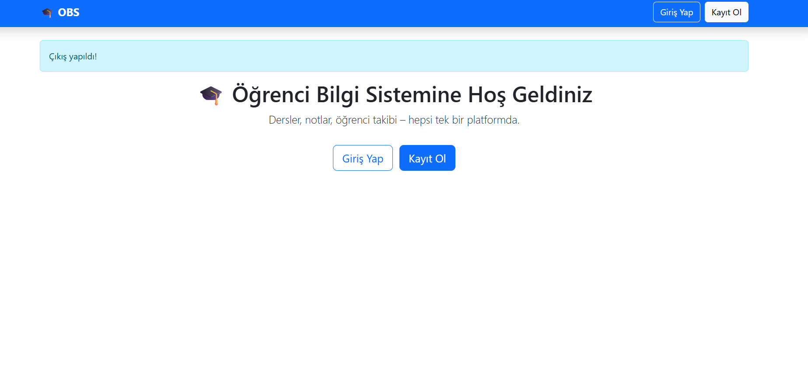
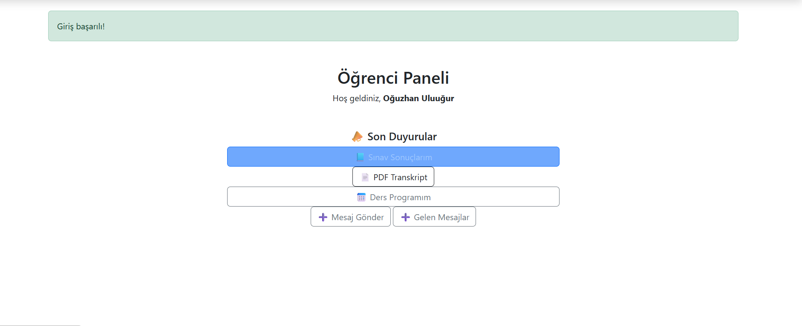
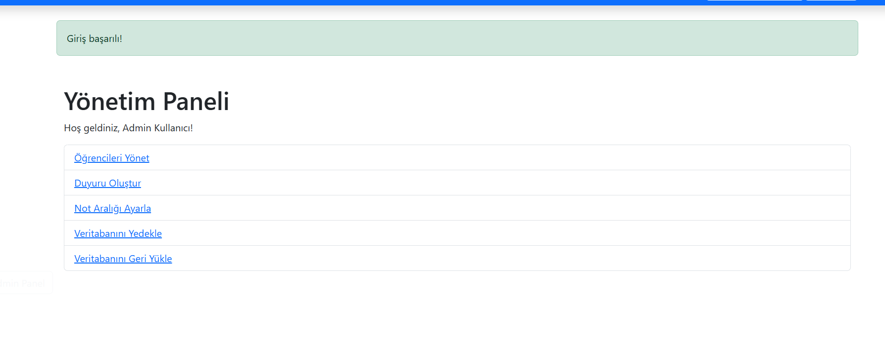

# 🎓 Öğrenci Bilgi Sistemi

Bu proje, öğrencilerin ders notları, programları ve duyuruları takip edebilecekleri; öğretim üyelerinin öğrenci bilgilerini yönetebileceği ve adminlerin veritabanı işlemlerini kolaylıkla yapabileceği bir sistemdir. Flask ve SQLite ile geliştirilmiştir.

## 🚀 Özellikler

✅ Öğrenci ve öğretim üyesi paneli  
✅ Yönetici paneli  
✅ Kullanıcı yönetimi  
✅ Ders programı oluşturma ve takip  
✅ Not yönetimi ve PDF/Excel çıktısı  
✅ Duyuru sistemi  
✅ Veritabanı yedekleme ve geri yükleme  
✅ Şifre sıfırlama özelliği

## ⚙️ Kullanıcı Rolleri

- 🧑‍🎓 Öğrenci
- 👨‍🏫 Öğretim Üyesi
- 👨‍💼 Admin

### 🔑 Varsayılan Admin
- **Email:** `admin@admin.com`  
- **Şifre:** `123456`

---

## ⚙️ Teknolojiler
- Python 🐍
- Flask (Jinja2 templating)
- SQLAlchemy (ORM)
- SQLite (veritabanı)
- Flask-Login, Flask-Mail, Flask-Admin
- Bootstrap 5
- ReportLab (PDF çıktısı)
- Pandas & openpyxl (Excel çıktısı)

---

## ✨ Yönetim Paneli

📌 Adres: [http://localhost:5000/admin-panel](http://localhost:5000/admin-panel)  
Burada admin işlemleri (kullanıcı yönetimi, duyurular, not aralıkları, veritabanı yönetimi) yapılabilir.

---

## 📝 Lisans

Bu proje **MIT Lisansı** altında sunulmaktadır.

---

## 💡 Katkıda Bulun

Pull request ve önerilere **açıktır**! 🚀

---

## 📬 İletişim

- 📧 e-posta: [alpermemis616@gmail.com](mailto:alpermemis616@gmail.com)
- 📍 Proje yazarı: **AlperMemiş**

---

### Görseller

**Giriş Sayfası:**

**Öğrenci Paneli:**

**Yönetim Paneli:**

---

